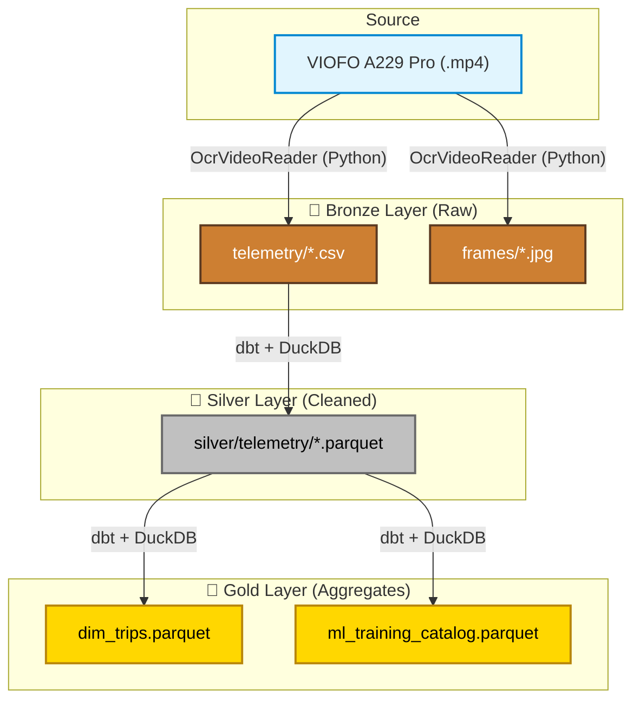

# TrafficLens Data Lake 🚦

Scalable Video Ingestion and Analytics Architecture for Dashcam Footage on AWS.

TrafficLens transforms raw dashcam video into actionable data (GPS tracks, speed, trips) using a Modern Data Stack approach (Python, dbt, DuckDB, Parquet, Streamlit).

---

## Architecture

### Domain-Driven Design (DDD) Layers

```
core/
├── domain/               # Entities & Value Objects (no external deps)
│   ├── telemetry_record.py   # TelemetryRecord (Pydantic)
│   ├── video_metadata.py     # VideoMetadata (Pydantic, frozen)
│   └── ports.py              # VideoReaderPort, TelemetryRepositoryPort (ABCs)
│
├── application/          # Use Cases (orchestration, no infra imports)
│   └── extract_telemetry.py  # ExtractTelemetryUseCase
│
├── infrastructure/       # Adapters (external tools sit here)
│   ├── ocr_video_reader.py       # OpenCV + Tesseract adapter
│   └── csv_telemetry_repository.py # CSV persistence adapter
│
├── dbt_project/          # SQL transformations (Silver & Gold layers)
│   └── models/
│       ├── silver/stg_telemetry.sql
│       └── gold/{dim_trips, ml_training_catalog}.sql
│
└── batch_ingest.py       # CLI entry point (Presentation layer)

frontend/                 # Streamlit dashboard
tests/
├── domain/               # Pure domain tests (no mocks needed)
├── application/          # Use case tests (in-memory fakes)
└── infrastructure/       # OCR parser logic tests
datalake/                 # Local storage (simulates AWS S3)
├── bronze/               # Raw CSVs + frames
├── silver/               # Partitioned Parquet (by date)
└── gold/                 # Business aggregates Parquet
```

---

## Data Lake Layers



### 🥉 Bronze — Raw Ingestion
- **Source**: VIOFO A229 Pro `.mp4` dashcam videos.
- **Process**: OCR extraction via `OcrVideoReader` (OpenCV + Tesseract).
- **Output**:
  - `datalake/bronze/telemetry/{video}.csv` — frame-by-frame telemetry.
  - `datalake/bronze/frames/{video}/*.jpg` — extracted frames at 1 FPS.

### 🥈 Silver — Cleaned & Typed
- **Process**: dbt + DuckDB (`stg_telemetry.sql`).
- **Output**: `datalake/silver/telemetry/partition_date=YYYY-MM-DD/*.parquet`
  - Timestamps → `DATETIME`, coordinates → `DOUBLE`, nulls removed.

### 🥇 Gold — Business Aggregates
- **`dim_trips.parquet`**: Trip summary (`trip_id`, `start_time`, `duration`, `avg_speed`, `distance_km`).
- **`ml_training_catalog.parquet`**: High-quality frames for ML training (`speed > 5 km/h`).

---

## 🚀 Setup

```bash
# 1. Create and activate conda environment
conda activate datalake

# 2. Install dependencies
pip install pydantic opencv-python-headless pytesseract dbt-duckdb streamlit pydeck duckdb pandas plotly
```

---

## ▶️ Running the Pipeline

### Ingest videos → Bronze → Silver → Gold
```bash
# Run from project root with conda env active
python core/batch_ingest.py /Volumes/External/dashcam/

# Dry-run to preview files without processing
python core/batch_ingest.py /Volumes/External/dashcam/ --dry-run
```

### Run dbt transformations manually
```bash
cd core/dbt_project
dbt run --profiles-dir .
```

### Launch the Streamlit dashboard
```bash
streamlit run frontend/app.py
```

---

## 🧪 Tests

```bash
# Run full test suite (conda datalake env)
/opt/anaconda3/envs/datalake/bin/python -m pytest tests/ -v

# Or with env active
conda activate datalake
python -m pytest tests/ -v
```

**Test coverage:**
| Layer | Tests |
|---|---|
| Domain (`TelemetryRecord`, `VideoMetadata`) | 10 |
| Application (`ExtractTelemetryUseCase`) | 3 |
| Infrastructure (`OcrVideoReader` parser) | 7 |
| **Total** | **20** |
